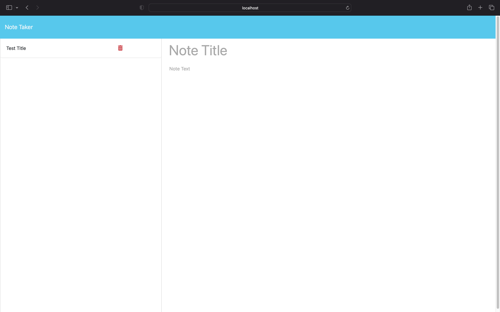

# Note_Taker...
This week's challenge is to modify starter code in order to create an Application called Note Taker. This application will be used to write and save notes. The application has a front-end part but it will use an Express.js back-end. It will save and retrieve nate data from a JSON file.

## Links...
### Heroku Deployed link:
[Salome M]()
### Github Repository link
[Salome M](https://github.com/Saiishago/Note_Taker...)

## Testing
After npm installing the packages that are needed to make this application function and modifying the code. In the terminal; npm start, if there are no errors the server running line will pop up [Server up and running >>>> http://localhost:3001], hover over the link and follow the link so it can open the front end side of the application and this will allow you to type, save and delete note as and when you please.

## Screenshots
### This is an image of the Note Taker app before notes are included.

### This is an image of the Note Taker app after notes are saved.

### This is an image of the Note Taker app after notes are deleted.

## Authors
Back-End modification; Salome K Mphago

© 2023 [Salome K Mphago](https://github.com/Saiishago). Full Stack Student.